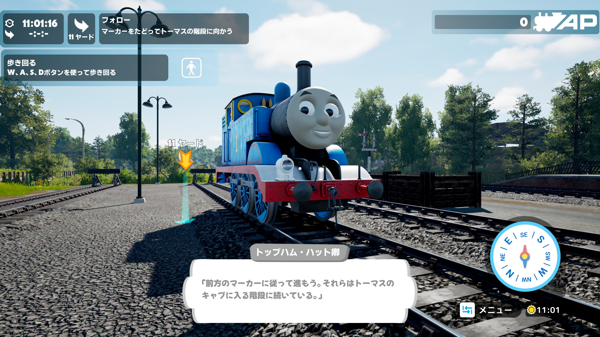
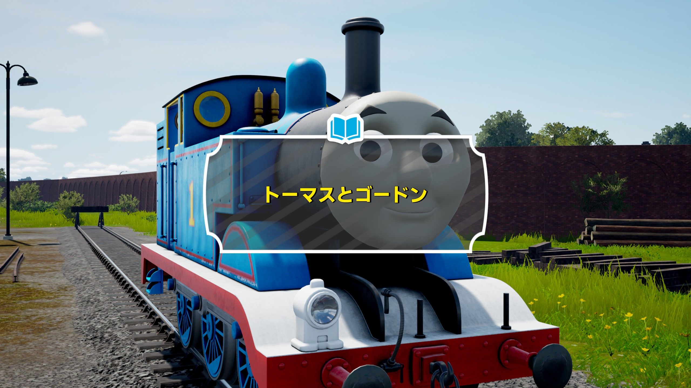
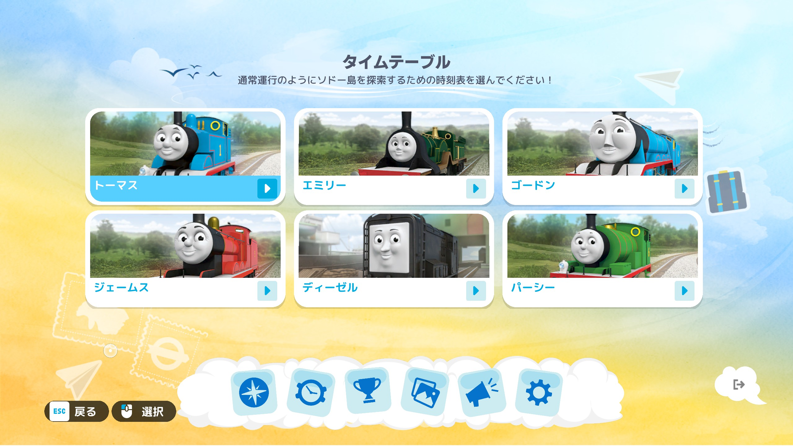
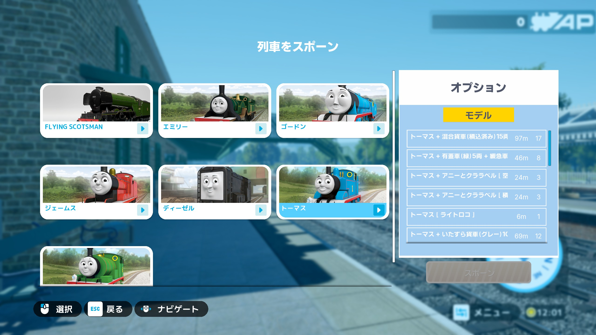

# WOS Japanese MOD



<h3 align="center">「きかんしゃトーマス™: ソドー島の不思議」向けの日本語表示最適化 MOD です。</h3>
ゲームの `TS2Prototype-WindowsNoEditor.pak` を **repak** で展開・再パックし、MOD 用アセットを反映します。

### ※ 現時点では翻訳（テキスト）そのものの修正は一部のみ、試験的実装です。今後のアップデートで順次修正範囲を拡大予定です。

補足: 中国語（簡体字）表示についても、可読性が出るよう **適切なウェイトの Noto Sans SC** を使うよう調整しています。

---

## 配布について

[**GitHub Releases（最新版）**](https://github.com/BEAR10591/WOS_JapaneseMOD/releases/latest) に **`.zip`** を公開しています。**常に最新版の zip をダウンロード**してから、展開し、同梱の手順に従ってください。  
ダウンロードする zip は、**Windows は `-Windows`、macOS は `-macOS`** が付いたものを選んでください。  
（リポジトリをクローンして使う場合も、以下の内容はほぼ同じです。）

### v0.1.0 から更新する場合（バックアップ保存先の変更）

v0.1.0 では、バックアップ（`Backup/`）が **展開した ZIP の中**に作られていました。  
v0.2.0 以降は、バックアップを **既定で OS のアプリデータ配下**に保存します。

そのため、v0.1.0 で作った `Backup/` を引き続き使いたい場合は、実行前に **既定の保存先へ移しておいてください**（既定保存先に同名ファイルが既にある場合は上書きに注意）。

- Windows（移動先）: `%LOCALAPPDATA%\WOS_JapaneseMOD\Backup\`
- macOS（移動先）: `~/Library/Application Support/WOS_JapaneseMOD/Backup/`

---

## 同梱物

**MOD データのフォルダ**（`WOS_JapaneseMOD_Knapford/`、`WOS_JapaneseMOD_SODOR/`）は Windows / macOS で共通です。  
適用処理は **Rust 製 CLI** が行います（バックアップ → 展開 → 上書きコピー → 再パック → ゲームへ書き戻し）。  
Windows: `WOS_JapaneseMOD.exe` / macOS: `WOS_JapaneseMOD`

### 設定（共通）

設定は **対話式**です（ツール起動後に案内に従って入力します）。  
入力した内容は次回以降も使えるように自動保存されます。

- Windows: `%LOCALAPPDATA%\\WOS_JapaneseMOD\\state.json`
- macOS: `~/Library/Application Support/WOS_JapaneseMOD/state.json`

### 対話式の詳細（何を聞かれる？）

起動後は「質問が表示される → 入力して Enter」という流れです。ここでは **よく出る質問**を、**質問→回答（入力例）**の形でまとめます（表示文言はバージョンや環境で多少前後します）。

- **Q. どの MOD を適用しますか？（Knapford / SODOR）**  
  **A.** `k`（Knapford）または `s`（SODOR）を入力します。  
  - 入力例: `k`  
  - 補足: どちらもゲームに入る pak 名は同じため、**最後に適用した方**が反映されます（後述の注意事項も参照）。

- **Q. ゲームの `Paks` フォルダはどこですか？（自動検出に失敗した場合）**  
  **A.** `Paks` ディレクトリの **フルパス**を入力します。  
  - 入力例（Windows）: `C:\Program Files (x86)\Steam\steamapps\common\Thomas & Friends™ Wonders of Sodor\WindowsNoEditor\TS2Prototype\Content\Paks`  
  - 入力例（macOS / Wine 等）: `/Users/<you>/.../drive_c/Program Files (x86)/Steam/steamapps/common/.../Content/Paks`

- **Q. repak の準備（自動取得 / 既存利用）**  
  **A.** 初回は repak を用意します。Windows は **自動ダウンロード**、macOS は事前に `brew` で導入してください。  
  - 補足: 2 回目以降は、取得済みであれば **再利用**されることがあります。

- **Q. バックアップはどこに作られますか？**  
  **A.** 初回実行時に、元の pak を `Backup` 配下へ保存します（既にあればスキップされます）。  
  - 既定の保存先（Windows）: `%LOCALAPPDATA%\WOS_JapaneseMOD\Backup\`  
  - 既定の保存先（macOS）: `~/Library/Application Support/WOS_JapaneseMOD/Backup/`

- **Q. 作業フォルダ（展開先）はどこですか？**  
  **A.** 展開した ZIP の中に作られます（成功時に自動削除される設定の場合があります）。  
  - 例: `WOS_pack_work_Knapford/` / `WOS_pack_work_SODOR/`

- **Q. 途中で失敗した／止まったように見える**  
  **A.** まずは **ゲームと Steam を終了**してから再実行してください。次に、`Paks` のパス入力が必要だった可能性があるので、案内が出たら **フルパス**を入力してください。  
  - 補足: 失敗時は作業フォルダが残ることがあります。原因切り分けの手がかりになるため、すぐ消さずに残しておくと便利です。

### 実行ファイル（配布物）

- macOS: `dist/macos/WOS_JapaneseMOD`
- Windows: （同等の Windows 向けビルドを配布物に同梱）

---

## 事前に用意するもの（Windows）

- **Steam 版**の『Thomas & Friends™: Wonders of Sodor』が **パソコンにインストール済み**であること。
- **インターネット接続**（初回のみ、後述の **repak** を自動で取りに行くため。2 回目以降は、すでに取得済みなら省略されることがあります）。
- 実行前に **ゲームと Steam を必ず終了**してください（ファイルの上書きに失敗しにくくなります）。

---

## かんたんな使い方（Windows）

1. **zip を展開する**  
   デスクトップなど、分かりやすい場所にフォルダごと置いてください。  
   （中に `WOS_JapaneseMOD.exe` と `WOS_JapaneseMOD_…` フォルダがある状態になっていれば OK です。）

2. **`WOS_JapaneseMOD.exe` を実行する**  
   起動後に表示される案内に従い、**k（Knapford）または s（SODOR）** を押して選択します。  
   黒い画面（コマンドプロンプト）が開き、処理が進みます。完了まで **閉じずに待ち**ます。

3. **（必要なら）`Paks` の場所を入力する**  
   自動検出できない環境では、案内に従って **`Paks` ディレクトリのフルパス**を入力します。

4. **初回だけバックアップが作られる**  
   ゲーム本体の元 pak が、既定で `%LOCALAPPDATA%\WOS_JapaneseMOD\Backup\` に保存されます。**元に戻したいとき**は、ここに保存されたファイルをゲームの `…\Paks\` に戻す方法を検討してください（自己責任です）。
   
   ※ **ゲーム本体がアップデート**されると、ゲーム側の pak が新しいものに置き換わることがあります。その場合は **もう一度 `WOS_JapaneseMOD.exe` を実行して MOD を再適用**してください。  
   ※ アップデート後に **バックアップも取り直したい**場合は、実行前に `%LOCALAPPDATA%\WOS_JapaneseMOD\Backup\` を **一度退避/削除**してから実行してください（バックアップが存在すると再作成をスキップします）。

5. **「完了」と出たら終了**  
   ツールが、再パックした pak をゲームの `Paks\` に書き戻して差し替えます（3種）。

### うまくいかないとき

- **ゲームや Steam を起動したまま**だと、ファイルがロックされて失敗することがあります。いったんすべて終了してから再実行してください。
- Steam の **ライブラリを別ドライブ**に置いているなどで自動検出できない場合は、起動後の対話で **Paks ディレクトリのフルパス**を入力してください。
- 初回実行時などに **「Windows により PC が保護されました（SmartScreen）」** が表示されることがあります。  
  これはウイルス検知ではなく、未署名の新しいアプリに対する警告（レピュテーション不足）です。
  - **実行方法**: 警告画面で「詳細情報」→「実行」をクリックしてください。
  - **補足**: ZIP を右クリック→プロパティ→「許可する（ブロックの解除）」にチェックしてから展開すると、警告が出にくくなる場合があります。

---

## 内部的に行うこと（Windows）

1. **repak** の準備（初回は GitHub から Windows 用を自動ダウンロードして配置。2 回目以降は再利用）  
1. ゲームの **元 pak（3種）** をバックアップに保存（**初回のみ**。既にあればスキップ）  
2. バックアップから pak を作業フォルダへ展開  
3. `WOS_JapaneseMOD_Knapford/` または `WOS_JapaneseMOD_SODOR/` の内容を **上書きコピー**  
4. **再パック**して、ゲームの `Paks\` に **直接書き戻し**（3種）  
5. 成功したら、作業フォルダを削除（`cleanup: true` の場合）

- **バックアップ**: `%LOCALAPPDATA%\WOS_JapaneseMOD\Backup\`  
- **作業フォルダ**: 展開した ZIP の中（`WOS_pack_work_Knapford\` / `WOS_pack_work_SODOR\`）。成功時は削除されます（失敗時に残ることがあります）。

---

## ゲームの pak の場所（Windows）

次の場所を自動で探します（通常の Steam 既定インストール向け）。見つからなければ対話でフルパスを入力します。

- `C:\Program Files (x86)\Steam\steamapps\common\Thomas & Friends™ Wonders of Sodor\WindowsNoEditor\TS2Prototype\Content\Paks`

---

## macOS で使う場合

macOS では、`brew` で `repak` を入れた上で、同梱の `WOS_JapaneseMOD` を実行します。

1. **Homebrew** で **repak** を入れます。

   ```bash
   brew install bear10591/tap/repak
   ```

2. `dist/macos/WOS_JapaneseMOD` を実行します（ターミナルからでも、Finder でダブルクリックでも可）。  
   処理の流れは Windows と同様です。

3. **ゲームの pak の場所**は、デフォルトで **Sikarugir** で作成した Steam（Wine 内）を想定しています。環境が違う場合は、起動後の対話で **Paks ディレクトリのフルパス**を入力してください。

---

## 注意事項

- ゲームファイルの改変は **自己責任** です。必ず **`Backup`** の有無を確認してください。
- Knapford 用と SODOR 用では **作業フォルダと MOD フォルダは別**ですが、**ゲームに入るファイル名は同じ** `TS2Prototype-WindowsNoEditor.pak` です。**最後に実行した方**がゲームに反映されます。
- オンライン規約・アンチチート等については、ご利用環境に応じてご確認ください。

---

## ライセンス

MIT License（詳細は `LICENSE` を参照）。ゲーム本体および Steam は各権利者の商標・著作物です。

---

## スクリーンショット




